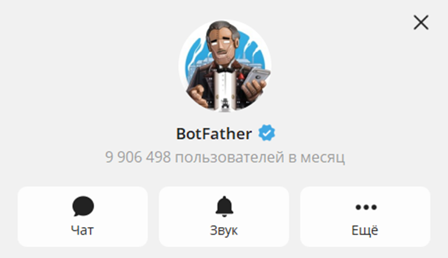
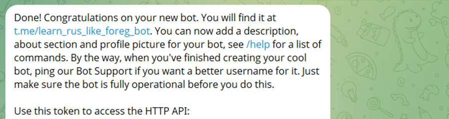
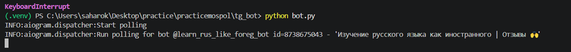
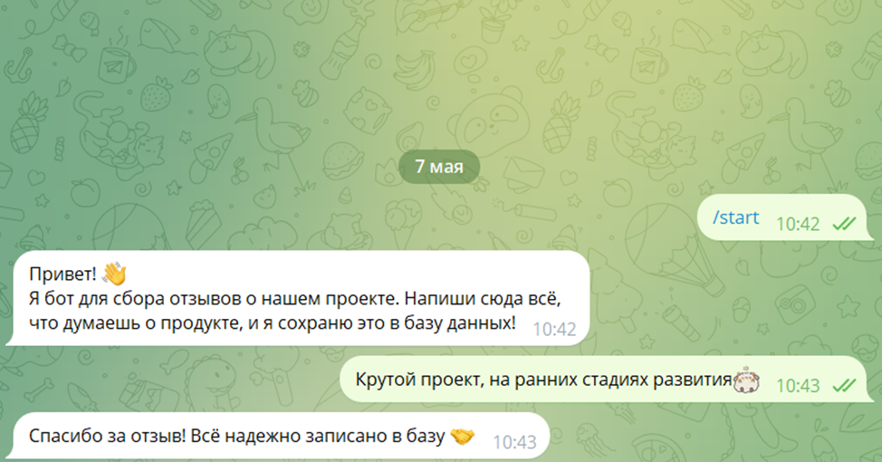
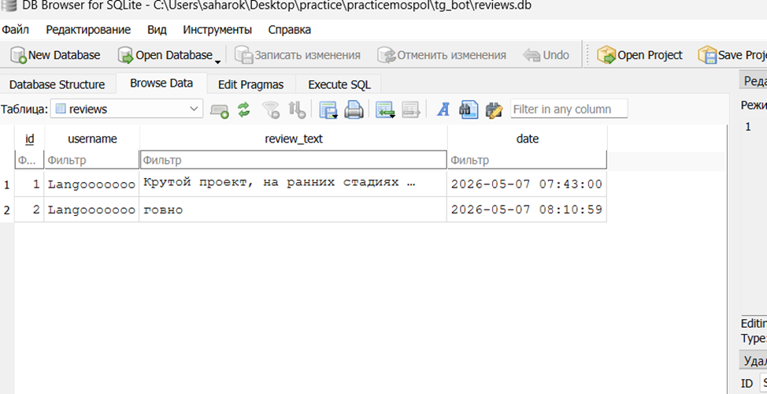

# Техническое руководство: Telegram-бот для обратной связи

В рамках проекта был разработан Telegram-бот, интегрированный со статическим сайтом. 

## 1. Назначение бота и как это работает
Бот выступает в роли модуля обратной связи. 
1. Пользователь заходит на сайт и кликает по ссылке на бота.
2. В Telegram нажимает `/start` и пишет свой отзыв.
3. Бот принимает сообщение и **автоматически сохраняет его в базу данных** (вместе с ником пользователя и временем отправки).
4. Разработчик в любой момент может открыть базу и прочитать все отзывы.

## 2. Стек технологий
* **Python** — основной язык программирования.
* **aiogram** — современная асинхронная библиотека для работы с Telegram.
* **SQLite3** — база данных для хранения отзывов.
* **python-dotenv** — для безопасного хранения секретного токена.

## 3. Модификация проекта
В процессе работы над проектом, на основе полученных знаний, базовая концепция была существенно модифицирована и улучшена:

1. **Замена текстового файла на базу данных.** Изначально отзывы просто записывались в обычный текстовый файл, что было неудобно. Я переделала это: теперь все данные хранятся в базе SQLite. Это намного надежнее — данные не перепутаются, и их гораздо легче просматривать.
2. **Защита базы данных от взлома.** Я добавила защиту от так называемых SQL-инъекций. Теперь при сохранении отзыва бот использует безопасный формат записи с (?, ?). Это гарантирует, что никто не сможет сломать базу, написав вредоносный код вместо обычного текста.
3. **Скрытие ключей доступа.** Раньше главный ключ бота (токен) лежал прямо в коде. Чтобы его никто не украл, я спрятала его в невидимый файл .env и запретила загружать этот файл на GitHub. Теперь код можно смело показывать в открытом доступе.

---

## 4. Инструкция по созданию

**Шаг 1: Получаем токен от Telegram**

1. Открой Telegram и найди бота `@BotFather`

2. Нажми Запустить (или отправь `/start`), затем отправь команду `/newbot`.

3. Напиши имя бота (например: Отзывы | Мой Проект).

4. Напиши юзернейм бота (обязательно на английском и заканчивается на bot)

5. Сохраняем токен , которые нам пришлют 

**Шаг 2: Создаем проект и виртуальное окружение**

1. Создай на компьютере пустую папку для бота

2. Открой эту папку в редакторе кода.

3. Создай виртуальное окружение командой:

        Windows: python -m venv venv
        Mac/Linux: python3 -m venv venv
4. Активируй виртуальное окружение:

        Windows: venv\Scripts\activate
        Mac/Linux: source venv/bin/activate

Слева в терминале должна появиться надпись `(venv)`

**Шаг 3: Устанавливаем библиотеку**

Пока горит `(.venv)`, скачиваем нужные инструменты для работы.

Вводишь в терминал:

        pip install aiogram python-dotenv

_`aiogram` — чтобы бот работал быстро и понимал Telegram._ 

_`python-dotenv` — чтобы научить Питон читать скрытые файлы с паролями._

**Шаг 4: Прячем токен (Файл .env)**

Токен нельзя светить в интернете. Мы спрячем его в специальный невидимый файл.

1. В папке `tg_bot` создаешь файл и называешь его ровно `.env` (с точкой в начале).

2. Открываешь его и пишешь туда одну строчку:

        TOKEN=ВАШ ТОКЕН

3. Сохраняешь файл.

**Шаг 5: Защищаем файлы от отправки на GitHub**

1. В папке `tg_bot` создаешь файл `.gitignore`.

2. Пишешь в него:

        venv/
        reviews.db
        __pycache__/
        .env

3)	Сохраняешь файл.

**Шаг 6: Пишем бота**

Теперь создаем сам код, который будет всё это связывать.

1. Создаешь файл `bot.py` (он должен лежать рядом с `.env` и `.gitignore`).

2. В начале скрипта производится импорт необходимых стандартных и сторонних библиотек:

        import asyncio
        import sqlite3
        import logging
        import os                           
        from dotenv import load_dotenv
        from aiogram import Bot, Dispatcher, types, F
        from aiogram.filters import Command

3. В целях соблюдения стандартов информационной безопасности API-токен не хранится в открытом виде в исходном коде. 

        load_dotenv() 
        TOKEN = os.getenv("TOKEN") 
        logging.basicConfig(level=logging.INFO)
        bot = Bot(token=TOKEN)
        dp = Dispatcher()

Вызов `load_dotenv()` осуществляет чтение конфигурационного файла `.env`, после чего токен извлекается в переменную. Создаются два ключевых объекта:

* Экземпляр класса `Bot`, выступающий в роли клиента для отправки запросов к серверам Telegram.
* Экземпляр класса `Dispatcher` (маршрутизатор), отвечающий за обработку входящих обновлений и их распределение по соответствующим функциям-обработчикам (хэндлерам).

4. Инициализация и структура базы данных 

        def init_db():
            conn = sqlite3.connect('reviews.db')
            cursor = conn.cursor()
            cursor.execute('''
                CREATE TABLE IF NOT EXISTS reviews (
                    id INTEGER PRIMARY KEY AUTOINCREMENT,
                    username TEXT,
                    review_text TEXT,
                    date TIMESTAMP DEFAULT CURRENT_TIMESTAMP
                )
            ''')
            conn.commit()
            conn.close()

Функция `init_db()` отвечает за создание и первоначальную настройку хранилища данных. При вызове устанавливается соединение с файлом `reviews.db.` С помощью DDL-запроса  создается таблица `reviews` со следующей структурой:

*   id (INTEGER) — первичный ключ.
*   username (TEXT) — идентификатор или имя пользователя.
*   review_text (TEXT) — текстовое содержимое отзыва.
*   date (TIMESTAMP) — время создания записи 

5. Обработка базовых команд

Декоратор `@dp.message(Command("start"))` регистрирует асинхронную функцию `cmd_start` как обработчик команды `/start`. При получении данного события от пользователя, бот генерирует и отправляет приветственное сообщение, информирующее о назначении данного модуля. 

        @dp.message(Command("start"))
        async def cmd_start(message: types.Message):
            welcome_text = (
                "Привет! 👋\n"
                "Я бот для сбора отзывов о нашем проекте. "
                "Напиши сюда всё, что думаешь о продукте!"
            )
            await message.answer(welcome_text)

6. Обработка пользовательского ввода и обеспечение безопасности.

        @dp.message(F.text)
        async def handle_review(message: types.Message):
            review = message.text
            username = message.from_user.username or message.from_user.first_name

            conn = sqlite3.connect('reviews.db')
            cursor = conn.cursor()
            cursor.execute('INSERT INTO reviews (username, review_text) VALUES (?, ?)', (username, review))
            conn.commit()
            conn.close()

            await message.answer("Спасибо за отзыв! Твое мнение очень важно для нас!🤝")

Блок реализует основную логику приложения:
*   `@dp.message(F.text)` перехватывает исключительно текстовые сообщения.
*   Функция извлекает текст отзыва и идентификатор отправителя (публичный Username, либо First Name, если никнейм скрыт).
*   Защита от уязвимостей.

7. Точка входа и запуск асинхронного цикла

        async def main():
            init_db()
            await bot.delete_webhook(drop_pending_updates=True)
            await dp.start_polling(bot)

        if __name__ == "__main__":
            asyncio.run(main())

Асинхронная функция `main()` определяет порядок запуска приложения:

1.	Вызывается `init_db()` для гарантии существования базы данных до начала приема сообщений.

2.	Метод `bot.delete_webhook(drop_pending_updates=True)` осуществляет очистку очереди накопившихся (устаревших) обновлений на серверах Telegram, предотвращая многократное срабатывание логики на старые сообщения при перезапуске сервера.

3.	Вызов `dp.start_polling(bot)` переводит бота в режим Long Polling (длительного опроса) для непрерывного прослушивания новых событий. Точка входа `if __name__ == "__main__"`: инициализирует событийный цикл через `asyncio.run(main())`.

**Шаг 7: Запуск и проверка**

1. Убедись, что все файлы сохранены.

2. В терминале (где всё еще горит .venv) введи команду:

        python bot.py

3. Если появилось сообщение Start polling — бот работает

4. Заходи в Telegram, жми `/start`, пиши отзыв.

5. В папке с кодом появится файл `reviews.db`. Открывай его через программу DB Browser for SQLite, там можно просмотреть свою базу данных.

Чтобы приостановить работу бота просто тыкни правой кнопкой мыши на пустое место в терминале и нажми сочетание клавиш `Ctrl + C` (английская раскладка).

